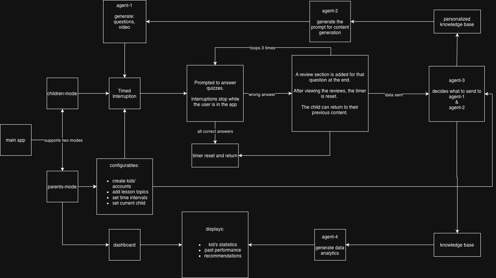

# hacktheeast

## Project Overview

**Problem:** Kids are spending excessive time doom-scrolling on their devices, leading to passive screen consumption with no mental engagement.

**Solution:** An app that interrupts kids' scrolling sessions with short, educational quizzes — refreshing their brains and turning idle screen time into learning moments. Interruptions are Alarmy-style and cannot be dismissed until the quiz is completed.

**Target Users:** Toddlers to early school-age children (up to ~12 years old), managed by their parents.

## Team Members & Roles

<!-- TODO -->

## Setup Instructions

This is a React Native app built with Expo.

1. Clone the repo and install dependencies:
   ```bash
   cd mobile
   npm install
   ```
2. Install [Expo Go](https://expo.dev/go) on your phone **or** set up an iOS Simulator / Android Emulator.
3. Start the dev server:
   ```bash
   npx expo start
   ```
4. Scan the QR code with Expo Go (Android) or the Camera app (iOS), or press `i` / `a` to open in a simulator/emulator.

## Architecture



The project is split into two parts:

- **`mobile/`** — React Native (Expo) client app.
- **`backend/`** — Backend service deployed to **AWS**. The mobile app communicates with the backend over the live AWS deployment (not localhost).

## Tech Stack

| Layer | Technology |
|-------|-----------|
| Frontend | React Native (Expo), TypeScript |
| State Management | React Context API |
| Local Storage | AsyncStorage |
| Backend | Node.js / TypeScript, deployed on AWS |
| APIs | TODO |
| Models | TODO |
| Track Tech Used | TODO |
